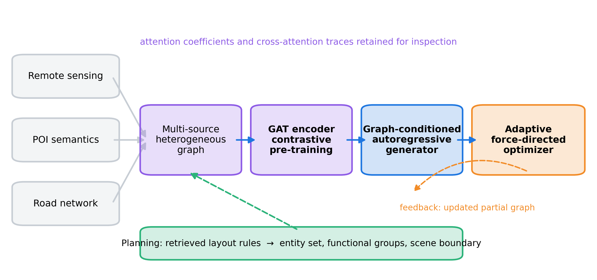

# HGC-Layout

Hierarchical graph contrastive layout generation for text-driven geospatial scenes. A
natural-language description of an urban district becomes a placed layout in five stages:
rule-informed planning, multi-source graph construction, graph contrastive pre-training,
graph-conditioned autoregressive placement, and adaptive force-directed refinement. Graph
attention coefficients and the cross-attention of every placement are retained, so each
layout decision can be inspected after generation.

## Overview

| Stage | What happens | Module |
|---|---|---|
| 1. Planning | Retrieves the top-K geospatial layout rules and emits an entity set with types, dimensions and functional groups, the scene boundary and a global context description | `hgc_layout/planning/` |
| 2. Graph construction | Builds a heterogeneous graph over planned entities plus POI, road-intersection and land-cover auxiliary nodes, with proximity, functional co-occurrence and road edges; node features concatenate remote-sensing, POI-semantic and structural blocks | `hgc_layout/graph/construction.py` |
| 3. Contrastive pre-training | Two corrupted views (feature dropout, edge removal and spurious edges) train a GAT encoder with the NT-Xent objective | `hgc_layout/graph/contrastive.py`, `hgc_layout/graph/gat.py` |
| 4. Generation | A Transformer decoder cross-attends to the partial graph and predicts a bivariate Gaussian mixture over coordinates and a von Mises orientation, entity by entity | `hgc_layout/generation/` |
| 5. Optimization | Five constraint types (collision, proximity, support, frontage, boundary) with per-pair weights predicted from the node embeddings, integrated with explicit Euler steps and attention-scaled deadlock evasion | `hgc_layout/optimization/` |

Target entities enter the graph without coordinates. Positions appear only as the
generator places them, so the reference layout never reaches the model at inference.



Also included: four compared methods (`hgc_layout/baselines/`), the eleven metrics and
the generation time (`hgc_layout/metrics/`), paired Wilcoxon tests with Holm correction
(`hgc_layout/stats/`), scene editing by command routing (`hgc_layout/editing/`), and the
experiment drivers for the comparison, ablations, sparsity robustness, editing latency
and score-reliability analyses (`hgc_layout/experiments.py`).

## Data

The evaluation benchmark is a set of text-conditioned 1 km² scenes with curated reference
layouts; it is under embargo and is not distributed here. `data/README.md` documents every
third-party source and its license, the expected JSON schema for `data/benchmark/`, the
tile-disjoint 60/20/20 split rule, and the deterministic offline substitutes used when the
optional encoders and language-model backends are absent. `scripts/prepare_data.py`
generates a synthetic benchmark in the same schema so that the whole pipeline runs out of
the box; numbers computed from it are illustrative only.

## Repository layout

```
hgc_layout/
  data/            scene schema, loaders, synthetic generator, feature encoders, sparsity
  planning/        rule store with top-K retrieval, template and language-model planners
  graph/           heterogeneous graph, multi-view augmentation, GAT encoder, NT-Xent
  generation/      mixture and von Mises heads, decoder with attention traces, retrieval
  optimization/    constraint forces, adaptive weights, violations, force-directed solver
  metrics/         fidelity, plausibility, semantic alignment, rating reliability
  baselines/       LayoutGPT, FW-FD, UrbanGAN, GraphRNN-Layout
  stats/           exact Wilcoxon signed-rank tests and Holm-Bonferroni correction
  pipeline.py      the framework, with every ablation switch
  training.py      the three training stages and checkpointing
  experiments.py   comparison, ablations, robustness, editing, reliability
  tables.py        aggregation and markdown/CSV rendering
configs/           main.yaml (full), demo.yaml (quick), real.yaml (data/benchmark)
scripts/           prepare_data, train, evaluate, make_tables, five figure scripts
data/              README, rules/, synthetic/ (benchmark/ and raw/ are git-ignored)
tests/             pytest suite
outputs/           run artefacts (git-ignored)
```

## Usage

### Quick demo (synthetic scenes, a few minutes on a laptop CPU)

```bash
pip install -e .
make demo
```

This generates 24 synthetic scenes, runs the three training stages, evaluates every
method and ablation on the test split, writes nine tables to `outputs/demo/` and draws the
five figures.

### Full run

```bash
python scripts/prepare_data.py --data synthetic --n-scenes 100   # or place real scenes in data/benchmark/
python scripts/train.py    --config configs/main.yaml
python scripts/evaluate.py --config configs/main.yaml
python scripts/make_tables.py --run-dir outputs/main
```

`--config configs/real.yaml` reads `data/benchmark/` instead of the synthetic scenes.
`scripts/evaluate.py --only comparison robustness` runs a subset of the experiment blocks.

### Configuration

One YAML file holds every hyper-parameter: the proximity threshold and encoder shape under
`graph`, the decoder shape and mixture size under `generator`, the base constraint
coefficients, integration step, unroll schedule and deadlock thresholds under `optimizer`,
and the metric thresholds, dropout levels and significance settings under `evaluation`.
The defaults in `configs/main.yaml` are the settings of the reported experiments; the
seeds listed under `seeds` are averaged in every table.

### Optional model backends

`pip install -e .[full]` adds torchvision, transformers, sentence-transformers and the
OpenAI client. With `OPENAI_API_KEY` set, `planner.kind: llm` uses a chat model for scene
planning and `evaluation.sp_model` uses one as the semantic-plausibility judge. Without
them the pipeline runs with deterministic offline substitutes; `semantic_plausibility`
reports which backend produced each score, and an offline score is not a model judgment.

### Outputs

`outputs/<run>/results.json` holds the per-scene, per-seed records; `make_tables.py` turns
them into the main comparison, the core and module ablations, the optimizer and
data-source ablations, the sparsity table, the editing-latency table, the reliability
report and the paired significance table, each as markdown and CSV, plus a combined
`all_tables.md`.

## Dependencies

Python 3.9 or newer with NumPy, SciPy, PyTorch, PyYAML, matplotlib and scikit-learn. The
demo runs on CPU; a GPU is used automatically only if the caller passes a CUDA device.
Run the test suite with `make test`.

## Notes on implementation choices

- The graph attention layers are implemented directly on an explicit edge index, with
  softmax over the incoming edges of each destination node, so no geometric-learning
  extension is required to run the code.
- Proximity is expressed edge to edge: the required centre distance adds both footprint
  half-extents, which keeps the constraint compatible with collision for entities of any
  size.
- Frontage holds an entity inside a band: it attracts when the entity is farther than the
  admissible distance from its designated road edge and repels when the entity intrudes on
  the prescribed control-line setback.
- Adaptive weights are parameterised so that an untrained network emits values of one,
  which reproduces the fixed-weight formulation exactly.
- The alignment loss reads only residual constraint violations and the unit prior, never
  reference coordinates; the generator is the one component supervised with the reference
  layout, and only during training.

## License

MIT. See `LICENSE`. Citation metadata is in `CITATION.cff`.
